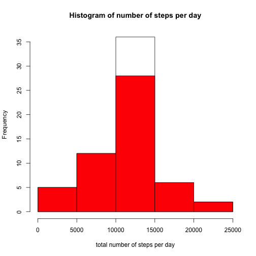
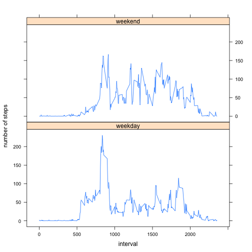

# Reproducible Research: Peer Assessment 1

## Loading and preprocessing the data


```r
unzip("activity.zip")
data <- read.csv("activity.csv", stringsAsFactors=FALSE)
```

## What is mean total number of steps taken per day?

```r
library(dplyr)
summary <- group_by(data, date) %>%
    summarise(total = sum(steps), mean = mean(steps), median = median(steps))
hist(summary$total, xlab = "total number of steps per day", main="Histogram of number of steps per day")
```

 

#### Mean of number of steps per day:


```r
mean(summary$total, na.rm = TRUE)
```

```
## [1] 10766.19
```
#### Median of number of steps per day:


```r
median(summary$total, na.rm = TRUE)
```

```
## [1] 10765
```

## What is the average daily activity pattern?
#### Here we show a plot of the number of steps taken in 5-minute intervals, averaged over all days.

```r
by_interval <- group_by(data, interval) %>%
    summarise(mean = mean(steps, na.rm = TRUE))
plot(by_interval$interval, by_interval$mean, type = "l", xlab = "5-minute interval", 
     ylab = "average number of steps over all days")
```

 
#### The 5-minute interval with the maximum number of steps, on average across all days:

```r
by_interval[by_interval$mean == max(by_interval$mean),]$interval
```

```
## [1] 835
```

## Imputing missing values

#### 1. Calculate and report the total number of missing values in the dataset (i.e. the total number of rows with NAs)

```r
sum(is.na(data$steps))
```

```
## [1] 2304
```

#### 2. Devise a strategy for filling in all of the missing values in the dataset. The strategy does not need to be sophisticated. For example, you could use the mean/median for that day, or the mean for that 5-minute interval, etc.

*I have chosen the strategy of using the mean for that 5-minute interval.*

#### 3. Create a new dataset that is equal to the original dataset but with the missing data filled in.

```r
tidydata <- data
replace <- is.na(data$steps)
tidydata$steps[replace] <- sapply(data$interval[replace], 
                                  function(x) {by_interval[by_interval$interval == x, "mean"]})
sum(is.na(tidydata$steps))
```

```
## [1] 0
```

#### 4. Make a histogram of the total number of steps taken each day and Calculate and report the mean and median total number of steps taken per day. Do these values differ from the estimates from the first part of the assignment? What is the impact of imputing missing data on the estimates of the total daily number of steps?
## What is mean total number of steps taken per day?

*The red part of the histogram is the dataset with the missing observations.*

```r
library(dplyr)
tidysummary <- group_by(tidydata, date) %>%
    summarise(total = sum(steps), mean = mean(steps), median = median(steps))
hist(tidysummary$total, xlab = "total number of steps per day", main="Histogram of number of steps per day")
hist(summary$total, col = "red", add = T)
```

 

*From the histogram we see that we get more days with the average number of steps. This indicates certain days have NA's on all observations, and since we skipped NA's in the first histogram, we now get more days reported.*

#### Mean of number of steps per day:


```r
mean(tidysummary$total, na.rm = TRUE)
```

```
## [1] 10766.19
```
#### Median of number of steps per day:


```r
median(tidysummary$total, na.rm = TRUE)
```

```
## [1] 10766.19
```


## Are there differences in activity patterns between weekdays and weekends?

#### 1. Create a new factor variable in the dataset with two levels -- "weekday" and "weekend" indicating whether a given date is a weekday or weekend day.


```r
isWeekend <- function(d) {if(d == "Saturday"|| d == "Sunday") return("weekend") else "weekday"}

tidydata$date <- as.Date(tidydata$date)
days <- weekdays(tidydata$date)
dayType <- as.factor(sapply(days, isWeekend))
tidydata <- cbind(tidydata, dayType)
```

#### 2. Make a panel plot containing a time series plot (i.e. type = "l") of the 5-minute interval (x-axis) and the average number of steps taken, averaged across all weekday days or weekend days (y-axis). 


```r
library(lattice)
by_interval <- group_by(tidydata, dayType, interval) %>%
    summarise(mean = mean(steps, na.rm = TRUE))
xyplot(by_interval$mean~by_interval$interval|by_interval$dayType, xlab = "interval", 
       ylab = "number of steps", type="l", layout = c(1,2))
```

 
